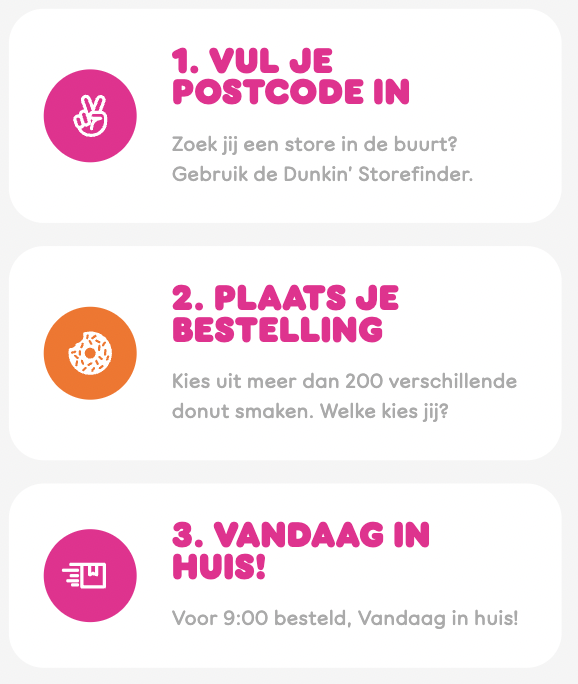
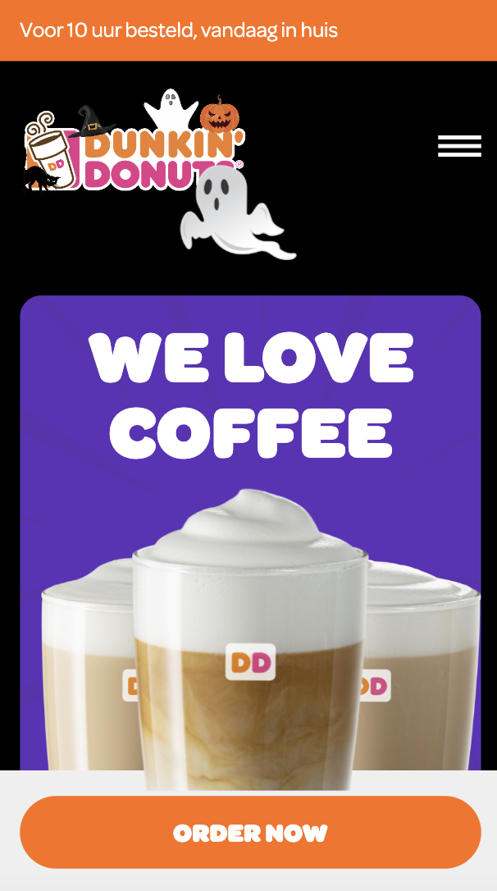

# Procesverslag
Markdown is een simpele manier om HTML te schrijven.  
Markdown cheat cheet: [Hulp bij het schrijven van Markdown](https://github.com/adam-p/markdown-here/wiki/Markdown-Cheatsheet).

Nb. De standaardstructuur en de spartaanse opmaak van de README.md zijn helemaal prima. Het gaat om de inhoud van je procesverslag. Besteedt de tijd voor pracht en praal aan je website.

Nb. Door *open* toe te voegen aan een *details* element kun je deze standaard open zetten. Fijn om dat steeds voor de relevante stuk(ken) te doen.

## Jij

  
uitwerken voor kick-off werkgroep

  ### Auteur:
  Yeliz Unlu

  #### Je startniveau:
  Rood

  #### Je focus:
  surface plane
 

## Je website

  
uitwerken voor kick-off werkgroep

  ### Je opdracht:
  https://www.dunkin.nl

  #### Screenshot(s) van de eerste pagina (small screen): 
  Home  
  

  #### Screenshot(s) van de tweede pagina (small screen):
  DD blogs  
  
 

## Toegankelijkheidstest 1/2 (week 1)

  
uitwerken na test in 1e werkgroep

  ### Bevindingen

  #### Screenreader
  doormiddel van een screenreader heb ik geprobeerd door de website te navigeren. 
  dit zijn de bevindingen:
  - erg onduidelijk. Moeilijk navigeren omdat je heel goed geconcentreerd moet
  luisteren wat er word gezegd. 
  - hij leest bepaalde teksten in 2 stukken voor en daarna in 1x.
  - leest bij app store image de id voor
  - leest bij play store image 'details'
  - in de footer leest die de social media de href voor

  oplossingen:
  - proberen het aantal links en knoppen te beperken op 1 pagina. 
  - gebruik geen br tag midden in een paragraaf tekst of heading.
  - gebruik juiste alt tekst

  #### Muis en Toetsenbord 
  ik heb de website gebruikt door alleen een toetsenbord te gebruiken. ik heb geprobeerd verschillende onderdelen in de website te navigeren.
  dit zijn de bevindingen:
  - geselecteerde links kregen blauwe dunnen borders. die waren moeilijk te zien.
  - sommige geselecteerde delen waren niet te zien. je weet niet waar je op staat.

  oplossingen:
  - maak geselecteerde delen duidelijk zichtbaar (kleur, dikte)
  - laat goed zien wat er geselecteerd is

  #### Motoriek (shocks, elastiekjes)  
  aan de hand van een apparaat aan de arm en een elastiek om de vinger helpt het je om een gebruiker te zijn met een motorieke beperking. Ik heb zo de website getest. 
  dit zijn de bevindingen:
  - kleine dingen zijn moeilijker te bedienen zoals radiobutton en checkboxen. Je klikt er makkelijk naast. 

  oplossing:
  - maak knoppen/click area groter

  #### Visueel (brillen, contrast, kleurenblind, dark/light). 
  ik heb de website getest met 3 verschillende brillen. de brillen helpen je om in te leven met iemand met een visuele beperking. hieruit komen de volgende bevindingen:
  - sommige letters zijn niet goed te zien. 
  - bestellen gaat moeilijk omdat het op dezelfde pagina in een small hokje word gedaan. 
  
  oplossingen:
  - grote headers gebruiken
  - bestellen op een aparte scherm weergeven. Dan heb je meer ruimte
  - hoog contrast gebruiken

## Breakdownschets (week 1)

  
uitwerken na afloop 2e werkgroep

  ### de hele pagina: 
  

  ### dynamisch deel (bijv menu): 
  

## Voortgang 1 (week 2)

  
uitwerken voor 1e voortgang

  ### Stand van zaken
  ik heb de breakdown schets gemaakt. Ik weet nu hoe het er eruit moet komen te zien.Ik weet alleen niet zeker of ik de juiste HTML tags op de juiste plekken heb gebruikt. 

  ### Agenda voor meeting
  samen met je groepje opstellen

Yeliz: 
1) Zijn de juiste article en section tags gebruikt?
2) waar moet de fixed element in de html komen?

Anouk:
1) hoe kan ik het beste css gebruiken met 2 pagina's?

Katarina: 
1) Wat is de h1 element op mijn pagina?
2) Hoe stijl ik een bepaalde element op mijn pagina?

  ### Verslag van meeting

  - aantal section en article tags waren niet goed gebruikt. Die heb ik verbeterd
  - gebruik ordered list tag bij de stappen
  - h1 is de naam van de website

## Voortgang 2 (week 3)

  
uitwerken voor 2e voortgang

  ### Stand van zaken
  achtergrond met witte golven op de achtergrond van de website is me niet gelukt om na te maken. 
  
  

  ik had moeite met het stijlen/positioneren van de stappen op de website. Ik had hiervoor de hulp ingeschakeld van de studentenassistenten.
  
  

  ### Agenda voor meeting

Yeliz: 
1) zijn de juiste tags gebruikt?
2) hoe krijg je position absolute responsive?

Anouk: 
1) hoe kan ik het beste css gebruiken met 2 pagina's?

Katarina: 
1) mag je 2 HTML documenten hebben of moet je alles in 1 document zetten?
2) Hoe kan ik een menu icoontje responsive maken?
3) Hoe kan ik blokjes naast de afbeeldingen krijgen bij responsivness?

  ### Verslag van meeting
  hier na afloop snel de uitkomsten van de meeting vastleggen

  - aantal tags stonden verkeerd. gebruik section voor social media iconen ipv div. 
  - gebruik vw bij position absolute
  - begin lijst van de surface plane zoals dark modus en audio

## Toegankelijkheidstest 2/2 (week 4)

  
uitwerken na test in 8e werkgroep

  ### Bevindingen
  #### Screenreader
  bevindingen: 
  - navigatie word voorgelezen terwijl die niet open staat.

  oplossingen:
  - gebruik :focus-within

  #### Muis en Toetsenbord 
  bevindingen: 
  - je ziet wat word geselecteerd door paarse border
  - navigatie elementen worden geselecteerd zonder dat het open staat.

  oplossingen:
  - gebruik :focus-within

  #### Motoriek (shocks, elastiekjes)
  bevindingen: 
  - scrollen gaat moeilijk het drukken op knoppen gaat wel makkelijk wanneer de knoppen groot genoeg zijn. 
  
  oplossingen: 
  - maak knoppen bestellen en afhalen iets groter

  #### Visueel (brillen, contrast, kleurenblind, dark/light). 
  bevindingen:
  - paragraaf tekst is moeilijk leesbaar bij dark mode. grijs en zwart zit te weinig contrast. 
  - grijze tekst op grijze achtergrond is moeilijk te lezen met blurred bil
  
  oplossingen:  
  - tekst veranderen naar wit bij dark mode
  - maak grijze tekst zwart voor meer contrast

## Voortgang 3 (week 4)

  
uitwerken voor 3e voortgang

  ### Stand van zaken
  animeren was best lastig. vooral de navigatie menu en het laten bewegen van de spook. 

  ### Agenda voor meeting

  Yeliz:
  1) moet je bij een search ook de form tags gebruiken?
  2) staat de animatie op de juiste plek in de html?

  Anouk:
  1) wat houd toegankelijkheid ++ in?
  2) wat is een praktische manier om je site naar github te zetten?

  Katarina:
  1) Hoe krijg ik die thema switcher button helemaal aan het eind of in het midden?
  2) Waarom werkt de thema switcher niet op de menu pagina?

  ### Verslag van meeting

  - Form moet een label hebben dan leest screenreader de labels voor en het liefst een submit button
  - animatie is niet belangrijkste in de html. Het kan onderaan de pagina of hou de alt attribuut leeg

## Eindgesprek (week 5)

  
uitwerken voor eindgesprek

  ### Je uitkomst - karakteristiek screenshots:
  
  

  ### Dit ging goed/Heb ik geleerd: 
  - gebruiken van audio met javascript.
  - het maken van een spook animatie. 
  - halloween thema toepassen. 
  - veel geleerd over positions.
  - gebruik van een screenreader
  

  ### Dit was lastig/Is niet gelukt:
  dit was lastig: 
  - line clamping 
  - badge in de footer op de rand van footer en de main krijgen
  - positioneren
  - selectoren gebruiken voor 2 pagina's

  dit is niet gelukt: 
  - golven op de achtergrond.
  - animatie van de nav met golven en tekst dat 1 voor 1 tevoorschijn komt. 
  

## Bronnenlijst

  
continu bijhouden terwijl je werkt

  1. How to play audio? (2012, 23 februari). Stack Overflow. Geraadpleegd op 27 september 2022, van https://stackoverflow.com/questions/9419263/how-to-play-audio 
  2. Element.getAttribute() - Web APIs | MDN. (2022, 19 september). Geraadpleegd op 27 september 2022, van https://developer.mozilla.org/en-US/docs/Web/API/Element/getAttribute
  3. Coyier, C. (2021, 2 oktober). Line Clampin' (Truncating Multiple Line Text). CSS-Tricks. Geraadpleegd op 27 september 2022, van https://css-tricks.com/line-clampin/
  4. Codepen (z.d.). Geraadpleegd op 27 september 2022, van https://codepen.io/yelunl123/pen/mdLBZBg
  5. :not() - CSS: Cascading Style Sheets | MDN. (2022, 27 september). Geraadpleegd op 29 september 2022, van https://developer.mozilla.org/en-US/docs/Web/CSS/:not
  6. How to center a “position: absolute” element. (2011, 14 december). Stack Overflow. Geraadpleegd op 3 oktober 2022, van https://stackoverflow.com/questions/8508275/how-to-center-a-position-absolute-element
  7. animation-fill-mode - CSS: Cascading Style Sheets | MDN. (2022, 27 september). Geraadpleegd op 3 oktober 2022, van https://developer.mozilla.org/en-US/docs/Web/CSS/animation-fill-mode
  8. alle afbeeldingen afkomstig van: dunkin donuts. (z.d.). [Dunkin donuts]. https://www.dunkin.nl
  

